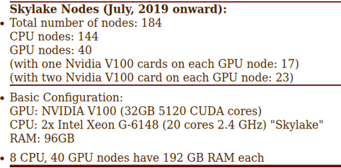
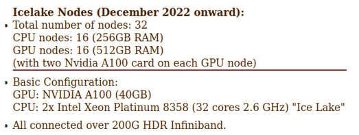
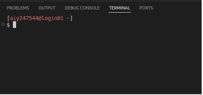

# HPC Documentation

### Table of Contents
1.  [Information about HPC](#information-about-hpc)
    -   [About storage](#about-storage)
    -   [About Nodes](#about-nodes)
2.  [Account Creation in HPC](#account-creation-in-hpc)
3.  [Setting up HPC in VSCode](#setting-up-hpc-in-vscode)
4.  [Internet Setup](#internet-setup)
5.  [Conda Setup](#conda-setup)
6.  [Types of Jobs](#types-of-jobs)
    -   [Interactive](#interactive)
    -   [Batch](#batch)
7.  [Research Proxy Setup](#research-proxy-setup)
8.  [Data Sharing between 2 HPC Accounts](#data-sharing-between-2-hpc-accounts)
9.  [AMGR](#amgr)


## Information about HPC

#### About storage
- In the root, we get 100GB storage
- In the scratch, we get 2TB

#### About Nodes

<br /><br />


<br /><br />


<br /><br />

By default, you will be logged into the login nodes, where your are not suppose to run any job.


## Account Creation in HPC

1. You can apply for HPC account using the following link [Apply for account](https://userm.iitd.ernet.in/usermanage/hpc.html)
2. Login using your Kerberos ID and Password
3. Fill `raunakbh` as ‘Faculty supervisor (uid)’
4. Choose **15th December** as Expiry Date
5. At first login perform one-time setup using the following command:
    ```
    source /home/apps/skeleton/oneTimeHPCAccountEnvSetup.sh
    ```

## Setting up HPC in VSCode

1. In the bottom left of the VSCode, click on the green button, like below
   <br />
   
   <br /><br />
   
3. Connect current window to host
4. Add new SSH host
5. `ssh {kerberos_username}@login1.hpc.iitd.ac.in`, enter twice, then connect

## Internet Setup

1. Download proxy.sh script from this repo and drag and drop to your hpc
2. In the username and password, add your kerberos credentials
3. In the `proxy_add` variable, use `https://proxy{PROGRAM_CODE}.iitd.ernet.in/cgi-bin/proxy.cgi`
    - PROGRAM_CODE is the value from below map:
        ```
        {'btech':22,'dual':62,'diit':21,'faculty':82,'integrated':21,'mtech':62,'phd':61,'retfaculty':82,
        'staff':21,'irdstaff':21,'mba':21,'mdes':21,'msc':21,'msr':21,'pgdip':21}
        ```
4. Make the script executable
5. Run the script using command:
    ```
    ./proxy.sh &
    ```
6. In the terminal, export the below variables:
    ```
    export http_proxy="http://proxy{PROGRAM_CODE}.iitd.ac.in:3128"
    export https_proxy="http://proxy{PROGRAM_CODE}.iitd.ac.in:3128"
    ```
7. Verify if the internet is working using:
    ```
    wget google.com
    ```

## Conda Setup

1. Use command:
    ```
    wget https://repo.anaconda.com/archive/Anaconda3-2024.06-1-Linux-x86_64.sh
    ```
    to download Anaconda Installer
2. Use command:
    ```
    sh Anaconda3-2024.06-1-Linux-x86_64.sh
    ```
    to install Anaconda

## Types of Jobs

#### Interactive

1. Request an interactive job:
    ```
    qsub -I -P {PROJECT_NAME} -q {QUEUE} -N {JOB_NAME} -lselect=1:ncpus=1:ngpus=1:centos={NODE} -lwalltime=1:00:00
    ```
    - NODE = icelake, skylake, haswell (default: haswell)
    - QUEUE = standard (default), high (high priority queue), scai_q  
    - Charges for different queues can be checked [here](https://supercomputing.iitd.ac.in/?charge)
2. If the internet connection breaks or the terminal is killed, the running job will also be killed.
3. You can use tools like `screen` or `tmux`; jobs requested inside these will continue even if connection breaks

#### Batch

1. Obtain the generic script for the batch job from this repo.
2. Submit the job:
    ```
    qsub batchjob.sh
    ```
3. Check status of all jobs:
    ```
    qstat -T -u {kerberos_userid}
    ```
4. To get detailed job information:
    ```
    qstat -ans {job_id}
    ```
5. To delete job:
    ```
    qdel {job_id}
    ```

**Notes:**
- The job can be requested for a maximum of 168 hours
- Maximum 10 jobs can run simultaneously
- Maximum 2 jobs (per user) on `scai_q` queue
- **Never run code on login nodes, after 30 warning notifications, your HPC account will be banned**

## Research Proxy Setup

1. Download the `research_proxy.sh` file from this repo and add it your hpc.
2. Add your kerberos credentials to the file
3. Request an HPC job
4. Make the bash file executable and then execute it using:
    ```
    ./research_proxy.sh &
    ```
    (in the same terminal where you got the job)
5. Export environment variables:
    ```
    export https_proxy=http://10.10.88.6:3128
    export http_proxy=http://10.10.88.6:3128
    ```
6. Verify your connection with:
    ```
    wget www.google.com
    ```
    (*ping is disabled in hpc*)

**Note:**  
Only one device or terminal can use the research proxy at a time. While the research proxy provides high-speed, large data downloads, compute performance remains the same as with the standard proxy—there's no extra compute power for research proxy users.

## Data Sharing between 2 HPC Accounts

1. Set ACL permissions for destination user:
    ```
    setfacl -m u:{KERBEROS_USERID_OF_DESTINATION}:rwx $HOME/scratch/datasets
    ```
2. Change permissions:
    ```
    chmod og+rwx $HOME/scratch/datasets
    ```

## AMGR

1. AMGR is used to check remaining balance
2. Open a new terminal (make sure conda is not active)
    ```
    amgr login          # login to amgr
    amgr ls project     # list all projects enrolled
    amgr checkbalance project -n {PROJECT_NAME}   # check balance of specific project
    ```
